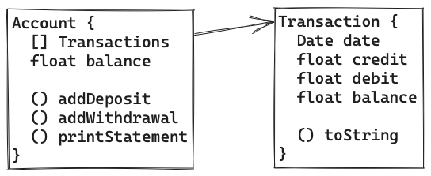

# Bank Tech Test

## Tech Test Requirements
```plain
* You should be able to interact with your code via a REPL like IRB or Node. (You don't need to implement a command line interface that takes input from STDIN.)
* Deposits, withdrawal.
* Account statement (date, amount, balance) printing.
* Data can be kept in memory (it doesn't need to be stored to a database or anything).
```

## Tech Test Acceptance Criteria
```plain
Given a client makes a deposit of 1000 on 10-01-2023
And a deposit of 2000 on 13-01-2023
And a withdrawal of 500 on 14-01-2023
When she prints her bank statement
Then she would see

date || credit || debit || balance
14/01/2023 || || 500.00 || 2500.00
13/01/2023 || 2000.00 || || 3000.00
10/01/2023 || 1000.00 || || 1000.00
```

## Design Process

#### Class Design


#### Function Design
```javascript
Account.addDeposit(amount, date)
  // Takes a float for amount, and a Date object
  // Adds amount to balance
  // Creates a Transaction object with debit == amount
  // Adds Transaction object to transactions list
  // Returns nothing

Account.addWithdrawal(amount, date)
  // Takes a float for amount, and a Date object
  // Subtracts amount from balance
  // Creates a Transaction object with credit == amount
  // Adds Transaction object to transactions list
  // Returns nothing

Account.printStatement()
  // Takes no arguments
  // Returns a string representing a list of transactions in reverse order
  // Formatted as:
  // date || credit || debit || balance


Transaction.toString()
  // Overloads javascripts Object.prototype.toString to return
  // 'date || credit || debit || balance' string
```

## Testing and Examples:
#### Input and Output examples
```javascript
const account = new Account();

account.addDeposit(1000, new Date());
account.printStatement(): 
// returns: 
// date || credit || debit || balance
// 19/06/2023 || 1000.00 || || 1000.00

account.addWithdrawal(400, new Date());
account.printStatement();
// returns: 
// date || credit || debit || balance
// 19/06/2023 || || 400.00 || 600.00
// 19/06/2023 || 1000.00 || || 1000.00
```

#### Edge cases:
```plain
* Account.addWithdrawal and Account.addDeposit will need to reject invalid inputs for both date and amount values.
* Sort function will need to be used to sort transactions in case that withdrawals and deposits are not provided in the chronological order
```