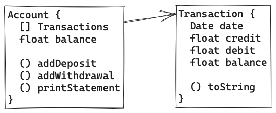

# Bank Tech Test
- [Bank Tech Test](#bank-tech-test)
  - [Tech Test Requirements and Acceptance Criteria](#tech-test-requirements-and-acceptance-criteria)
  - [Design Process](#design-process)
      - [Thought process](#thought-process)
      - [Edge cases and possible changes in the future](#edge-cases-and-possible-changes-in-the-future)
      - [Initial Class Design and Function Design](#initial-class-design-and-function-design)
  - [Testing and Examples:](#testing-and-examples)
      - [Input and Output examples](#input-and-output-examples)
  - [How to Install and Run code](#how-to-install-and-run-code)
      - [Environment setup](#environment-setup)
      - [Run Program](#run-program)
      - [Run Tests](#run-tests)

## Tech Test Requirements and Acceptance Criteria
```plain
* You should be able to interact with your code via a REPL like IRB or Node. (You don't need to implement a command line interface that takes input from STDIN.)
* Deposits, withdrawal.
* Account statement (date, amount, balance) printing.
* Data can be kept in memory (it doesn't need to be stored to a database or anything).
```

```plain
Given a client makes a deposit of 1000 on 10-01-2023
And a deposit of 2000 on 13-01-2023
And a withdrawal of 500 on 14-01-2023
When she prints her bank statement
Then she would see

date || credit || debit || balance
14/01/2023 || || 500.00 || 2500.00
13/01/2023 || 2000.00 || || 3000.00
10/01/2023 || 1000.00 || || 1000.00
```

## Design Process
#### Thought process
```plain
I have opted to go for a simple OO design pattern where an Account class will currently hold the relevant Transaction objects. I believe this approach would make the code base easy to expand on in the future, with the Account possibly storing an AccountHolder object that would contain the relevant user information.

The date argument in addDeposit and addWithdrawals is currently locked to be a Date object, and is an optional argument. This choice was made to allow the codebase to enforce a consistent format to data stored, regardless of the frontend interface used.

The Transaction class is currently used for both Deposits and Withdrawals, with just a single constructor that can take either a debit, credit or both values at the same time. 
This felt like a more appropriate solution in the current scope of the exercise, as well as an easier solution to expand on in the future, where Transaction could possibly be used as an interface with Deposit and Withdrawal being child classes with more unique implementations added to thise individually if necessary.
```
#### Edge cases and possible changes in the future
```plain
- Account.addWithdrawal and Account.addDeposit will need to reject invalid inputs for both date and amount values.
- Sort function will need to be used to sort transactions in case that withdrawals and deposits are not provided in the chronological order (To be implemented at a later date if the end user will be given a way to provide a date of the transactions)
```
#### Initial Class Design and Function Design


```javascript
Account.addDeposit(amount, date)
  // Takes a float for amount, and a Date object
  // Adds amount to balance
  // Creates a Transaction object with debit == amount
  // Adds Transaction object to transactions list
  // Returns nothing

Account.addWithdrawal(amount, date)
  // Takes a float for amount, and a Date object
  // Subtracts amount from balance
  // Creates a Transaction object with credit == amount
  // Adds Transaction object to transactions list
  // Returns nothing

Account.printStatement()
  // Takes no arguments
  // Returns a string representing a list of transactions in reverse order
  // Formatted as:
  // date || credit || debit || balance


Transaction.toString()
  // Overloads javascripts Object.prototype.toString to return
  // 'date || credit || debit || balance' string
```

## Testing and Examples:
#### Input and Output examples
```javascript
const account = new Account();

account.addDeposit(1000, new Date());
account.printStatement(): 
// returns: 
// date || credit || debit || balance
// 19/06/2023 || 1000.00 || || 1000.00

account.addWithdrawal(400, new Date());
account.printStatement();
// returns: 
// date || credit || debit || balance
// 19/06/2023 || || 400.00 || 600.00
// 19/06/2023 || 1000.00 || || 1000.00
```

## How to Install and Run code
#### Environment setup
```zsh
# If you do not currently have nvm (Node Version Manager) installed, run these two lines.
curl -o- https://raw.githubusercontent.com/nvm-sh/nvm/v0.39.1/install.sh | bash
source ~/.zshrc

# If you already have nvm installed on your machine, only run these two lines
nvm use node
npm install
```

#### Run Program
```zsh
# There is currently no command line interface, therefore the app has to be interacted with through Node.
# To run node:
node

# And once in node:
const Account = require('./src/account.js')

# This will import the main Account class to test available methods and their functionality
# The data is currently not persisting between individual instances of node
```
#### Run Tests
```zsh
# To test coverage:
npm run test

# To list all created tests:
jest --verbose

# To run an output for the example given in the tech test requirements:
npm run tech_test
```